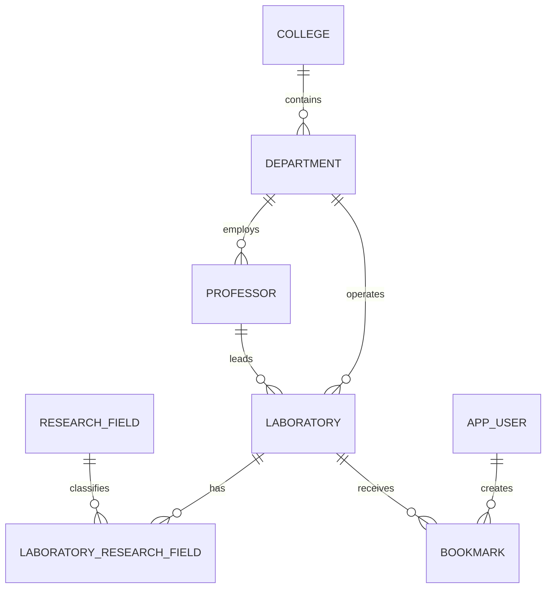

# 연구실 검색 서비스 ERD

- 연구실은 책임 교수 및 학과를 각각 하나씩 반드시 가진다.
- 연구 분야는 0개 이상이며 연결 테이블의 복합 기본키로 중복을 막는다.
- 연구실은 `deleted_at`으로 소프트 삭제한다.
- 활성 연구실의 이름은 학과 내에서 중복될 수 없다. `active_name`을 생성 컬럼으로 관리하고 `(department_id, active_name)` 유니크 제약을 적용한다.
- 소프트 삭제된 연구실의 `active_name`은 `NULL`이므로 같은 학과에서 이름을 재사용할 수 있고 삭제 이력도 보존된다.
- 모집 상태는 `RECRUITING`, `ALWAYS_OPEN`, `CLOSED`, `UNKNOWN`만 저장할 수 있다.
- `bookmarkCount`는 저장하지 않고 `bookmark`를 집계하며, `(laboratory_id)` 보조 인덱스를 사용한다.
- 단과대·학과·교수 참조 삭제는 제한하고, 연구실 물리 삭제 시 연결 데이터와 북마크는 연쇄 삭제한다.
